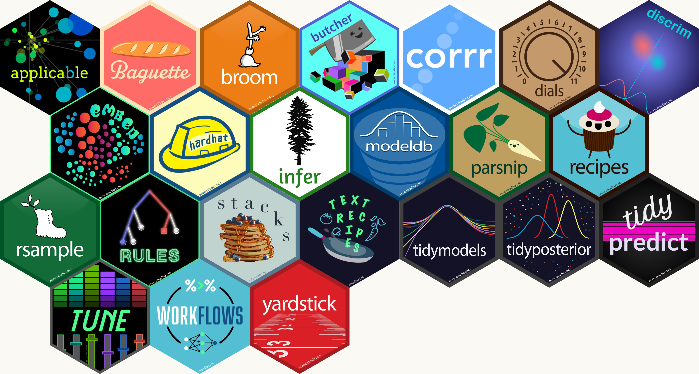

<div>

```{css, echo= FALSE}
.avatar{
  border-radius: 50%;
  float: left;
}
```
 <div class="main-text"><h4>PhD student in Epidemiology</h4>
  <h4><a href="https://barkerlab.ucdavis.edu/">Barker Lab</a></h4>
  <h4>Univeristy of California, Davis</h4>
<h4>I am a veterinarian training as a research epidemiologist with a focus on vector-borne diseases. Currently I am investigating arbovirus transmission dynamics in the dengue-endemic city of Iquitos, Peru by building statistical, mathematical and spatio-temporal models.<h4><div>
 
  <div class="main-photo"></div>

<div class="bottom-photo"></div>
